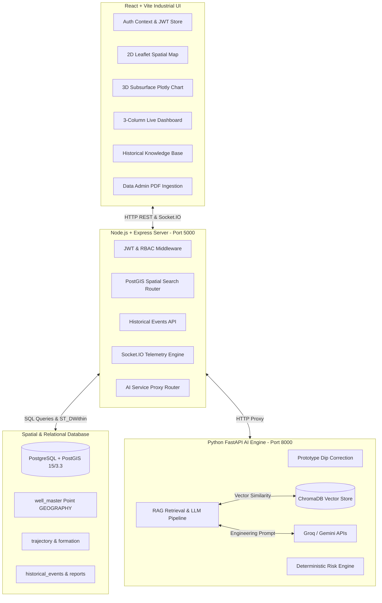
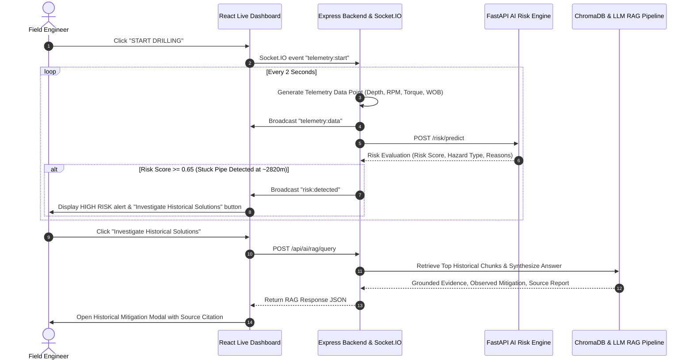

# RigMind-NWIS Architecture Specification

## Overview Architecture

```mermaid
graph TB
    subgraph Frontend [React + Vite Industrial UI]
        FE_AUTH[Auth Context & JWT Store]
        FE_MAP2D[2D Leaflet Spatial Map]
        FE_MAP3D[3D Subsurface Plotly Chart]
        FE_DASH[3-Column Live Dashboard]
        FE_KNOW[Historical Knowledge Base]
        FE_ADMIN[Data Admin PDF Ingestion]
    end

    subgraph CoreBackend [Node.js + Express Server - Port 5000]
        BE_JWT[JWT & RBAC Middleware]
        BE_SPATIAL[PostGIS Spatial Search Router]
        BE_HIST[Historical Events API]
        BE_SOCK[Socket.IO Telemetry Engine]
        BE_PROXY[AI Service Proxy Router]
    end

    subgraph DataStore [Spatial & Relational Database]
        PG[(PostgreSQL + PostGIS 15/3.3)]
        PG_MAST[well_master Point GEOGRAPHY]
        PG_TRAJ[trajectory & formation]
        PG_EV[historical_events & reports]
    end

    subgraph AIService [Python FastAPI AI Engine - Port 8000]
        AI_DIP[Prototype Dip Correction]
        AI_RISK[Deterministic Risk Engine]
        AI_RAG[RAG Retrieval & LLM Pipeline]
        CHROMA[(ChromaDB Vector Store)]
        LLM[Groq / Gemini APIs]
    end

    Frontend <-->|HTTP REST & Socket.IO| CoreBackend
    CoreBackend <-->|SQL Queries & ST_DWithin| DataStore
    CoreBackend <-->|HTTP Proxy| AIService
    AI_RAG <-->|Vector Similarity| CHROMA
    AI_RAG <-->|Engineering Prompt| LLM
```

## Sequence Diagram: Live Telemetry Risk Alert to RAG Investigation

```mermaid
sequenceDiagram
    autonumber
    actor FE as Field Engineer
    participant UI as React Live Dashboard
    participant BE as Express Backend & Socket.IO
    participant AI as FastAPI AI Risk Engine
    participant RAG as ChromaDB & LLM RAG Pipeline

    FE->>UI: Click "START DRILLING"
    UI->>BE: Socket.IO event "telemetry:start"
    loop Every 2 Seconds
        BE->>BE: Generate Telemetry Data Point (Depth, RPM, Torque, WOB)
        BE->>UI: Broadcast "telemetry:data"
        BE->>AI: POST /risk/predict
        AI-->>BE: Risk Evaluation (Risk Score, Hazard Type, Reasons)
        alt Risk Score >= 0.65 (Stuck Pipe Detected at ~2820m)
            BE->>UI: Broadcast "risk:detected"
            UI->>FE: Display HIGH RISK alert & "Investigate Historical Solutions" button
        end
    end

    FE->>UI: Click "Investigate Historical Solutions"
    UI->>BE: POST /api/ai/rag/query
    BE->>RAG: Retrieve Top Historical Chunks & Synthesize Answer
    RAG-->>BE: Grounded Evidence, Observed Mitigation, Source Report
    BE-->>UI: Return RAG Response JSON
    UI->>FE: Open Historical Mitigation Modal with Source Citation
```
