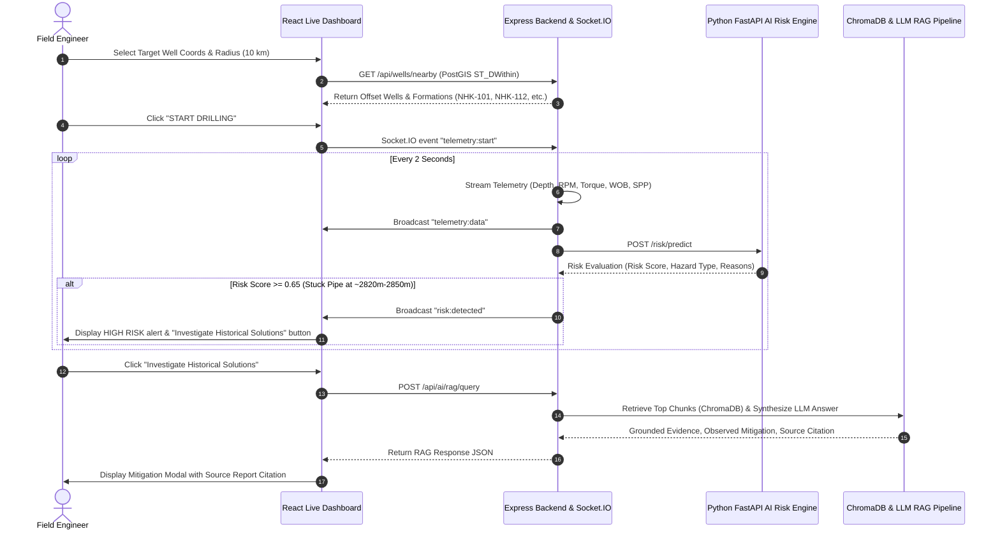

# RigMind-NWIS — Comprehensive Project Documentation

> **Smart India Hackathon 2026 Prototype for Oil India Limited (OIL)**  
> *"Learn from what happened in nearby historical wells before the same problem happens again."*

---

## 1. Executive Overview & Problem Statement

**RigMind-NWIS** is an integrated industrial decision-support platform engineered for field engineers, drilling superintendents, and geoscientists operating in oilfields (specifically modeled for Oil India Limited in the Upper Assam basin).

### The Challenge
In oil & gas drilling operations, **Non-Productive Time (NPT)** caused by downhole hazards—such as differential/mechanical stuck pipe, severe mud circulation loss, and unexpected formation kick or overpressure—costs operators millions of dollars per well and poses major environmental and equipment risks.

### The Solution
RigMind-NWIS correlates real-time streaming rig telemetry with historical offset well reports within a 5 km – 10 km geographic radius. By applying geological stratigraphic dip corrections and leveraging RAG (Retrieval-Augmented Generation) historical evidence retrieval, RigMind-NWIS predicts hazards *before* they occur and presents verified mitigation steps directly from past completion reports (WCR) and daily drilling reports (DDR).

---

## 2. System Architecture & Implementation

The application uses a **microservice 3-tier decoupled architecture** designed for high throughput, sub-second telemetry processing, and resilient zero-dependency fallback capability:

```
                       +-----------------------------------+
                       |    React 18 + Vite Industrial UI  |
                       | (Leaflet, Plotly 3D, Chart.js)    |
                       +-----------------+-----------------+
                                         |
                                  REST / Socket.IO
                                         |
                       +-----------------v-----------------+
                       |    Node.js + Express Backend      |
                       |    (JWT Auth, PostGIS Spatial)    |
                       +--------+----------------+---------+
                                |                |
                  PostgreSQL /  |                | HTTP API Proxy
                  PostGIS       |                |
                       +--------v-------+  +-----v-------------------+
                       | PostgreSQL DB  |  | Python FastAPI AI       |
                       | (SRID 4326)    |  | Service (Risk & RAG)    |
                       +----------------+  +-----+-------------+-----+
                                                 |             |
                                            ChromaDB Vector  Groq / Gemini
                                            Vector Store     LLM APIs
```

### Core Components Summary
1. **Frontend (React 18 + Vite)**: Single-Page Application with responsive industrial layout, dark/light theme support, 2D Leaflet map, Plotly 3D subsurface trajectory renderer, multi-chart dashboard, and Data Admin PDF upload portal.
2. **Core Backend (Node.js + Express)**: Manages JWT authentication, RBAC middleware, PostGIS spatial queries (`ST_DWithin`), Socket.IO WebSocket server for real-time telemetry streaming, and proxy routes to the AI service.
3. **AI & RAG Service (Python FastAPI)**: Handles 3D Stratigraphic Dip Correction math (`dip_correction.py`), deterministic multi-parameter risk evaluation (`engine.py`), PDF document chunking and vector indexing in ChromaDB (`pipeline.py`), and Groq/Gemini LLM synthesis.
4. **Data Store (PostgreSQL 15 + PostGIS 3.3)**: Relational schema for users, master well directory, 3D trajectories, formation stratigraphy, historical incident events, and DDR/WCR report extraction metadata.

---

## 3. Operational Workflow (How It Works)



---

## 4. Parameter Dictionary

RigMind-NWIS utilizes parameters categorized across three operational domains:

### 4.1 Real-Time Telemetry Parameters
| Parameter | Unit | Description & Operational Purpose |
| :--- | :--- | :--- |
| **Measured Depth (MD)** | meters (`m`) | Current vertical depth reached by the drill bit downhole. |
| **Rate of Penetration (ROP)** | meters/hr (`m/hr`) | Drilling speed through formation rock. Sudden spikes indicate porous zones or overpressure. |
| **Weight on Bit (WOB)** | kilopounds (`klbs`) | Downward mechanical force applied on bit cutter head. |
| **Rotary Speed (RPM)** | revolutions/min | Speed of drillstring rotation. Sudden drop indicates string sticking or torque building. |
| **Torque** | `kN.m` / `ft-lbs` | Rotational resistance. High torque spikes indicate differential or mechanical pipe sticking. |
| **Standpipe Pressure (SPP)** | `psi` | Hydraulic pressure of drilling fluid. Pressure drops signal lost circulation or nozzle washout. |
| **Flow Rate** | gallons/min (`gpm`) | Drilling fluid pumping volume. Essential for flushing cuttings out of hole. |
| **Mud Weight** | specific gravity (`sg`) | Density of drilling fluid used to balance formation pore pressure. |

### 4.2 Spatial & Geological Parameters
| Parameter | Description |
| :--- | :--- |
| **Latitude / Longitude** | WGS 84 spatial point geography (`SRID 4326`) used by PostGIS for exact distance calculations. |
| **Survey Radius (`km`)** | Search distance boundary (e.g. 5 km or 10 km) for aggregating historical offset well data. |
| **Dip Angle (`°`)** | Regional geological planar tilt of formation rock strata (e.g. 5.0° SE in Assam basin). |
| **Dip Azimuth (`°`)** | Compass heading direction of formation structural dip plane. |
| **Structural Depth Shift (`m`)** | Depth adjustment shift computed as: `Shift = Distance (m) * tan(Dip Angle)`. |

### 4.3 Risk Engine Threshold Parameters
| Risk Category | Mathematical & Rule Threshold Criteria |
| :--- | :--- |
| **Stuck Pipe** | Depth Proximity $\le 100\text{ m}$ AND ($\text{RPM} < 70$ OR $\text{Torque} > 25\text{ kN.m}$ OR $\text{WOB} > 50\text{ klbs}$). |
| **Mud Loss** | Depth Proximity $\le 80\text{ m}$ AND ($\text{Flow Rate drop} > 15\%$ OR $\text{SPP drop} > 200\text{ psi}$). |
| **Kick / Overpressure**| Depth Proximity $\le 100\text{ m}$ AND ($\text{SPP drop} > 150\text{ psi}$ AND $\text{ROP spike} > 40\%$). |

---

## 5. Technologies Used

| Technology Layer | Frameworks & Libraries Used |
| :--- | :--- |
| **Frontend Framework** | React 18, Vite build tool, Tailwind CSS, Lucide React Icons, React Router v6 |
| **Graphs & Visualization** | Plotly.js (`react-plotly.js`), Chart.js (`react-chartjs-2`), Leaflet / React-Leaflet GIS |
| **Backend Framework** | Node.js (v18+), Express.js, `jsonwebtoken` (JWT), `socket.io` (WebSockets), `pg` PostgreSQL driver |
| **AI Service Engine** | Python 3.11, FastAPI, Uvicorn ASGI server, SciPy, NumPy, PyPDF |
| **RAG & LLM Services** | ChromaDB vector store, LangChain, Groq API (`llama-3.1-8b-instant`), Google Gemini API fallback |
| **Database & GIS** | PostgreSQL 15, PostGIS 3.3 (Spatial indexing using GiST, geography data type) |

---

## 6. Role-Based Routing & Access Control (RBAC)

RigMind-NWIS enforces security and operational authorization at both client and server boundaries:

### Client-Side Routes (`App.jsx`)
- `/login`: Public authentication endpoint. Users log in as either `FIELD_ENGINEER` or `DATA_ADMIN`.
- `/initialize`: Protected route (Both roles). Coordinates selection, radius configuration, and spatial query execution.
- `/subsurface-map`: Protected route (Both roles). Interactive Plotly 3D subsurface trajectory viewer with dip correction.
- `/dashboard`: Protected route (Both roles). 3-column real-time telemetry streaming, Chart.js time-series, risk alert banner, and RAG modal.
- `/knowledge-base`: Protected route (Both roles). Searchable offset well event repository.
- `/admin`: **RESTRICTED ROUTE (`DATA_ADMIN` only)**. Ingestion portal for uploading Daily Drilling Reports (DDR) / Well Completion Reports (WCR) in PDF format and triggering ChromaDB re-indexing.

---

## 7. Graphs and Visualizations Specification

| Graph / Visualization | Component File | Description | Engineering Rationale (Why Used) |
| :--- | :--- | :--- | :--- |
| **3D Subsurface Trajectory Map** | `SubsurfaceMapPage.jsx` | Plotly 3D scatter and surface mesh plot showing target trajectory (Green), offset trajectories (Grey), and formation planes. | Allows drilling superintendents to visually assess spatial proximity between planned trajectory and historical offset bores in 3D, preventing collision risks and evaluating fault planes. |
| **2D Interactive GIS Map** | `InitializePage.jsx` | Leaflet spatial map displaying latitude/longitude of wellheads, search radius circles, and hazard pins. | Provides geographical orientation in field coordinates (Upper Assam basin) relative to nearby historical wells. |
| **Real-Time Telemetry Line Charts** | `DashboardPage.jsx` | 4 streaming Chart.js time-series plots: Depth, RPM, Torque, and Weight on Bit. | Enables rig crew to spot immediate parameter divergence (e.g. Torque rising while RPM drops) before mechanical stuck pipe occurs. |
| **Vertical Depth Timeline / Barcode** | `DashboardPage.jsx` | Vertical progress bar representing 0m to 3500m depth with formation depth bands and hazard flags. | Gives engineers a clear vertical preview of upcoming high-risk geological strata before the bit enters the danger zone. |
| **Dynamic Risk Score Gauge** | `DashboardPage.jsx` | Dynamic score gauge (0.0 to 1.0) with hazard badge (GREEN / RED) and action buttons. | Serves as an un-missable alert interface that automatically prompts the user to launch RAG evidence investigation. |

---

> **Word Document Download**: A formatted Microsoft Word (`.docx`) copy of this entire document has been generated and saved to:  
> [RigMind_NWIS_Project_Documentation.docx](file:///d:/Projects/Hackathon2026/RigMind_NWIS_Project_Documentation.docx)
